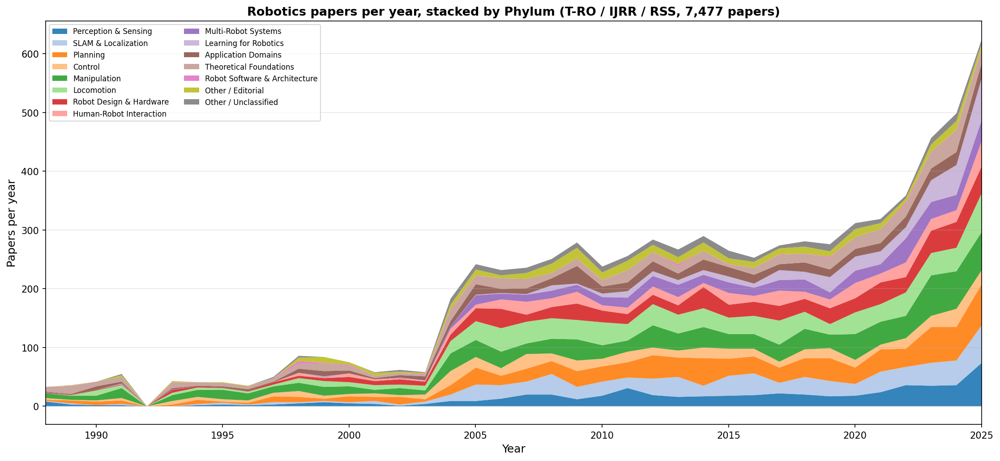
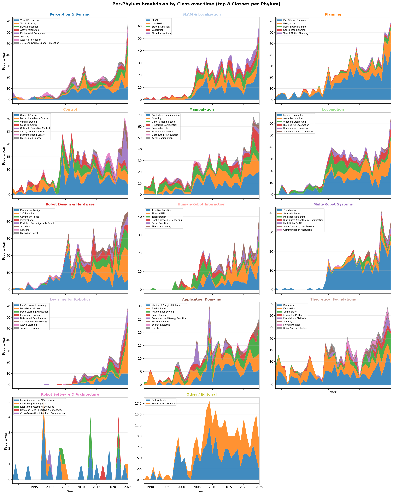
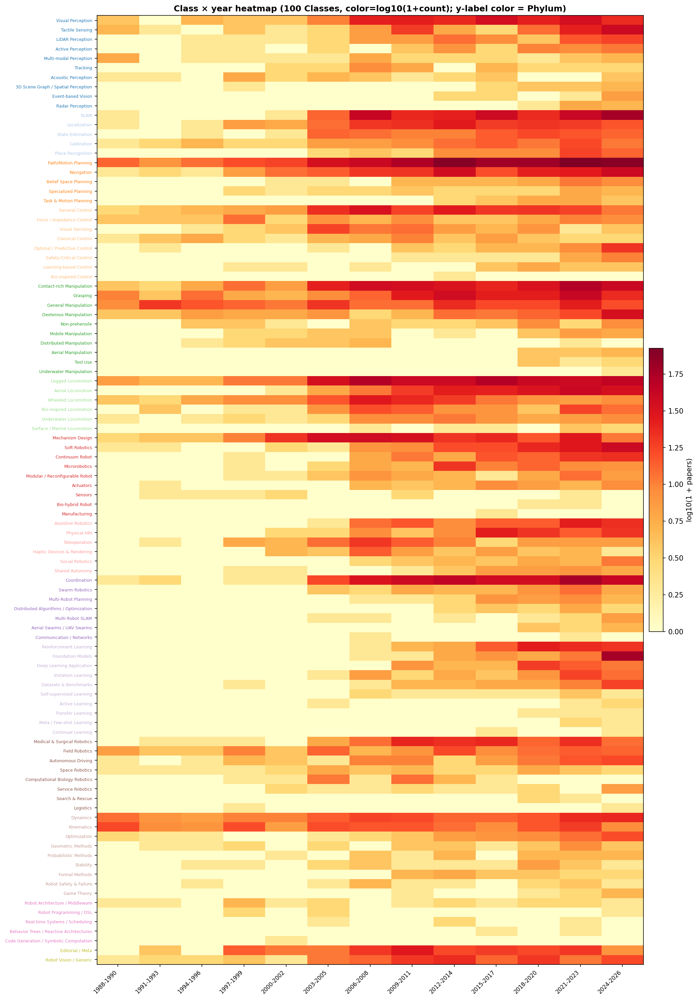
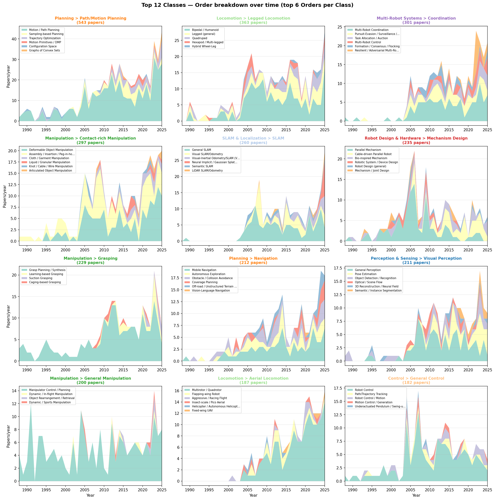

**언어**: [English](README.en.md) | 한국어

# Robotics Paper Phylogenetic Taxonomy

🌐 **Live site**: <https://gisbi-kim.github.io/robotics-paper-phylogeny/>

> 7,477편의 로봇공학 논문(T-RO / IJRR / RSS, 1988~2025)을 시맨틱하게 분류해서 생물 계통도(phylogenetic taxonomy)처럼 묶은 결과물.

원 데이터는 **RoboPaper Atlas**에서 발췌. T-RO, IJRR, RSS 세 저널의 논문 제목/연도/저자/인용수를 받아서, **단순 TF-IDF가 아니라 시맨틱 동의어 클러스터** 기반으로 **4단계** (`Phylum > Class > Order > Genus`) 트리에 매핑.

- **모든 논문이 4-depth 라벨링**: Phylum / Class / Order는 100%, Genus는 specific rule이 매칭된 경우(약 52%) + 나머지는 `(general)`로 채워짐.

---

## EDA 시각화 (Stage B)

[`eda/`](eda/) 폴더에 4개의 raw 데이터 시각화 — 자세한 설명은 [eda/README.md](eda/README.md).

| Plot | 미리보기 | 설명 |
|---|---|---|
| 1. Phylum stack | [](eda/figures/01_phylum_stack.png) | 13 Phylum × 연도 stacked area. 시대별 분야 비중. |
| 2. Per-Phylum small multiples | [](eda/figures/02_phylum_small_multiples.png) | 각 Phylum 내 top 8 Class 변화. |
| 3. Class heatmap | [](eda/figures/03_class_heatmap.png) | 100 Class × 3년 bucket. 어느 Class가 언제 활성화? |
| 4. Top 12 Class drill | [](eda/figures/04_top_classes_drill.png) | 인기 Class 내부 Order 분해 (SLAM, Grasping 등 패러다임 전환 가시화). |

> 인터랙티브 버전: [eda/interactive/01_phylum_stack.html](eda/interactive/01_phylum_stack.html), [eda/interactive/03_class_heatmap.html](eda/interactive/03_class_heatmap.html) — 다운로드 후 브라우저로 열기.

---

## 산출물 (Deliverables)

| 파일 | 설명 |
|---|---|
| **[`robotics_taxonomy.xlsx`](robotics_taxonomy.xlsx)** | 메인 결과 — 3 시트 (Papers / Taxonomy_Tree / Stats), **4-depth (P/C/O/G)** |
| [`TAXONOMY.md`](TAXONOMY.md) | 13 Phylum × ~95 Class × ~330 Order 전체 트리 |
| [`TAXONOMY_CHANGES.md`](TAXONOMY_CHANGES.md) | 초안 vs 7,477편 통독 후 비교/업데이트 설명 |
| [`PLAN.md`](PLAN.md) | 작업 플랜 |
| [`REFRESH.md`](REFRESH.md) | RoboPaper Atlas snapshot에서 citation/DOI 동기화 절차 |
| [`refresh_from_atlas.py`](refresh_from_atlas.py) | atlas xlsx → citation/DOI 갱신 + `papers.json` 재생성 |
| [`classify.py`](classify.py) | 1~3 단계 분류기 (Phylum/Class/Order) |
| [`genus_rules.py`](genus_rules.py) | 4단계 분류기 (Genus, top 45 Order에 sub-rule) |
| [`make_excel.py`](make_excel.py) | 분류 결과 → 엑셀 변환 스크립트 |
| [`data/raw/data.txt`](data/raw/data.txt) | 원본 (RoboPaper Atlas dump) |
| [`data/raw/task.txt`](data/raw/task.txt) | 사용자 원본 task 지시 |
| [`data/intermediate/papers_parsed.json`](data/intermediate/papers_parsed.json) | 1차 파싱 결과 (7,477편) |
| [`data/intermediate/titles_chronological.txt`](data/intermediate/titles_chronological.txt) | 시간순 제목 리스트 (통독용) |
| [`data/intermediate/reading_notes.md`](data/intermediate/reading_notes.md) | 통독 중 메모 |
| [`data/intermediate/papers_classified.json`](data/intermediate/papers_classified.json) | 분류 라벨 부착 결과 (4-depth) |

---

## 분류 분포 요약

총 7,477편. 13 Phylum + Editorial + Unclassified 합쳐 15개 카테고리.

| Phylum | 논문 수 | % |
|---|---:|---:|
| Manipulation | 934 | 12.5% |
| Locomotion | 842 | 11.3% |
| Planning | 835 | 11.2% |
| SLAM & Localization | 670 | 9.0% |
| Robot Design & Hardware | 623 | 8.3% |
| Perception & Sensing | 554 | 7.4% |
| Theoretical Foundations | 491 | 6.6% |
| Control | 441 | 5.9% |
| Multi-Robot Systems | 408 | 5.5% |
| Application Domains | 396 | 5.3% |
| Human-Robot Interaction | 395 | 5.3% |
| Learning for Robotics | 354 | 4.7% |
| Robot Software & Architecture | 30 | 0.4% |
| Other / Editorial | 288 | 3.9% |
| **Other / Unclassified** | **216** | **2.9%** |
| **합계** | **7,477** | **100%** |

### Top 10 Class

| Phylum > Class | 논문 수 |
|---|---:|
| Planning > Path/Motion Planning | 477 |
| Locomotion > Legged Locomotion | 337 |
| Manipulation > Contact-rich Manipulation | 297 |
| Multi-Robot Systems > Coordination | 284 |
| SLAM & Localization > SLAM | 259 |
| Robot Design & Hardware > Mechanism Design | 227 |
| Manipulation > Grasping | 218 |
| Planning > Navigation | 209 |
| Manipulation > General Manipulation | 194 |
| Locomotion > Aerial Locomotion | 184 |

---

## 13개 Phylum 한 줄 설명

1. **Perception & Sensing** — 시각·LiDAR·촉각·이벤트·다중모달 인식
2. **SLAM & Localization** — 위치추정, 매핑, 캘리브레이션, Place Recognition
3. **Planning** — 경로/모션/태스크/네비게이션/탐사 계획
4. **Control** — 고전·예측·임피던스·안전·학습 기반 제어
5. **Manipulation** — 그래스핑·dexterous·deformable·조립·non-prehensile·이동조작
6. **Locomotion** — 다리·바퀴·공중·수중·바이오 영감 이동
7. **Robot Design & Hardware** — 소프트·연속체·모듈러·마이크로·액추에이터 설계
8. **Human-Robot Interaction** — pHRI, 텔레오퍼레이션, 어시스티브, 햅틱
9. **Multi-Robot Systems** — 군집, 조정, MAPF, 분산 SLAM, aerial swarm
10. **Learning for Robotics** — RL, IL, VLA, Diffusion Policy, 데이터셋
11. **Application Domains** — 의료·필드·자율주행·우주·서비스·계산생물학
12. **Theoretical Foundations** — 기구학, 동역학, 최적화, Lie 그룹, 안전성
13. **Robot Software & Architecture** — 미들웨어, BT, 코드젠, 실시간

---

## 작업 흐름 (재현 가능)

```bash
# 1. 데이터 파싱 (raw → JSON)
#    data/raw/data.txt를 읽어 7,477편 추출 → data/intermediate/papers_parsed.json

# 2. 통독 → 노트 작성
#    data/intermediate/titles_chronological.txt를 시간순으로 읽으며
#    data/intermediate/reading_notes.md에 메모.
#    이 결과를 TAXONOMY_CHANGES.md로 정리, TAXONOMY.md를 최종안으로 갱신.

# 3. 분류기 실행 (P/C/O 1차 분류 + Genus 4단계 분류)
python3 classify.py
# → /tmp/classified.json (백업본은 data/intermediate/papers_classified.json)

# 4. 엑셀 생성 (4-depth 컬럼 포함)
python3 make_excel.py → robotics_taxonomy.xlsx
```

> 의존성: `python3` + `openpyxl`만 있으면 됨.

---

## 분류 방법론 (왜 TF-IDF가 아닌가)

작업 지시(`data/raw/task.txt`)에 명시된 핵심 요건:
> "단순히 단어를 분리해서 tf idf 하라는게 아니야. 시맨틱하게 너가 어텐션타서 잘 판단하란 얘기야"
> "예를들어서 어떤 논문은 laser place recognition 이라고 할수도있고 어떤애는 point cloud based loop detection이라고도 할수있겠지만 이런 계열들은 다 place recognition으로 묶고"

→ 따라서 분류기 ([`classify.py`](classify.py))는 **동의어 클러스터(synonym cluster)**를 직접 정의:

```python
LIDAR = ['lidar', 'laser scan', 'point cloud', '3d point', 'range scan', ...]
PLACE_RECOG = ['place recognition', 'loop closure', 'loop detection',
               'global localization', 'visual localization', 'vpr', ...]

if has_any(t, PLACE_RECOG):
    if has_any(t, LIDAR):
        return ('SLAM & Localization', 'Place Recognition', 'LiDAR-based')
    if has_any(t, VISUAL):
        return ('SLAM & Localization', 'Place Recognition', 'Visual-based')
```

→ "laser place recognition", "point cloud loop detection", "lidar VPR" 같은 표현이 **모두** `Place Recognition / LiDAR-based`로 묶임. 우선순위 규칙(specific → general)으로 cross-cutting 처리.

---

## 한계

- **단일 라벨**: 한 논문 = 한 카테고리. 멀티-필드 논문은 우선순위 규칙으로 가장 specific한 곳으로 보냄.
- **제목만 사용**: abstract 없음. 제목이 모호하면 분류 정확도 저하.
- **미분류 12.4%**: 너무 specific하거나 catchall에 안 걸린 케이스. `Other / Unclassified`로 두고 사용자가 검토 가능.

---

## 라이선스 / 데이터 출처

- 원본 논문 메타데이터: T-RO, IJRR, RSS 저널 (DBLP + OpenAlex 기반 RoboPaper Atlas)
- 본 분류 작업물(코드 + 택소노미): 자유 사용 가능
